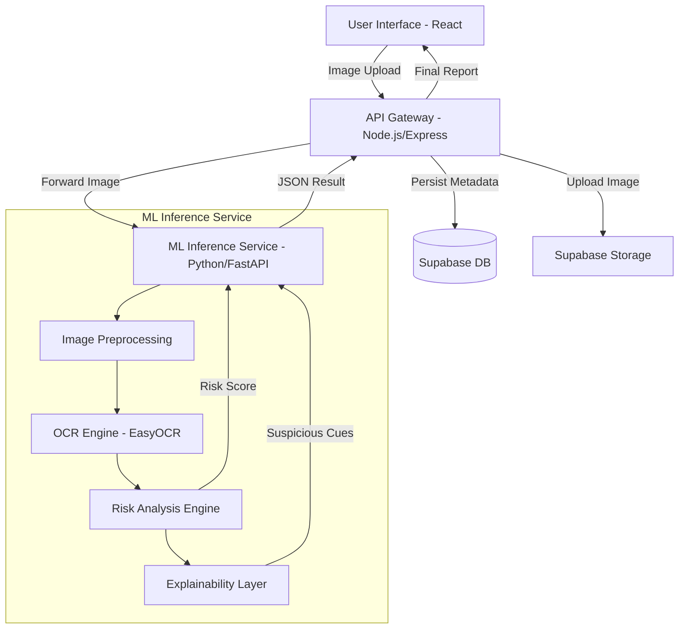

# PhishLens AI: Technical Implementation Plan

PhishLens AI is a specialized security tool designed to detect phishing threats within images (screenshots, posters, forwarded messages) using a combination of Optical Character Recognition (OCR), Machine Learning (ML), and Rule-based analysis.

## 🏗️ System Architecture

The project follows a microservices-inspired architecture to separate the compute-heavy ML processing from the application logic.



---

## 🛠️ Tech Stack

| Component | Technology | Rationale |
| :--- | :--- | :--- |
| **Frontend** | React, Tailwind CSS, Lucide Icons | Responsive, state-driven UI for real-time results. |
| **Orchestration** | Node.js, Express.js | Efficient I/O handling and integration with Supabase. |
| **ML Engine** | Python, FastAPI | High-performance async service for ML/OCR workload. |
| **OCR** | EasyOCR | Better handling of stylized and low-res text than Tesseract. |
| **ML Model** | Scikit-learn (Random Forest) | Reliable classification for text-based phishing features. |
| **Backend-as-a-Service** | Supabase (Auth, DB, Storage) | Simplifies user management and file storage. |

---

## 🧩 Core Functional Modules

### 1. Image Preprocessing Pipeline
To maximize OCR accuracy, images are processed before text extraction:
- **Denoising:** Gaussian blur to remove compression artifacts.
- **Grayscale Conversion:** Simplifies color data.
- **Adaptive Thresholding:** Enhances contrast between text and background.

### 2. Hybrid Detection Engine
The system uses two parallel paths for detection:
- **Rule-Based (Regex):** Immediate flagging of known scams (e.g., suspicious UPI IDs, phone numbers, or hardcoded keywords like "SBI BLOCK").
- **Machine Learning (TF-IDF + Random Forest):** Analyzes the *sentiment* and *urgency* of the text to detect novel phishing attempts.

### 3. Explainability Layer
Instead of a binary "Safe/Unsafe" result, the engine maps detection results back to specific "Cues":
- **Urgency Cues:** Keywords indicating pressure (e.g., "Immediately," "Within 24 hours").
- **Financial Cues:** Keywords indicating bait (e.g., "Cashback," "Lottery").
- **Authority Cues:** Keywords spoofing trusted entities (e.g., "Govt of India," "Bank Support").

---

## 📅 Development Roadmap

### Phase 1: Infrastructure Setup
- [ ] Initialize Supabase project (Database tables: `scans`, `profiles`).
- [ ] Set up Supabase Storage bucket for image uploads.
- [ ] Configure Python virtual environment and Node.js workspace.

### Phase 2: ML & OCR Service (Python)
- [ ] Implement OCR pipeline using **EasyOCR**.
- [ ] Build the `/extract` and `/analyze` endpoints in FastAPI.
- [ ] Develop the Hybrid Detection Engine (ML model + Regex patterns).
- [ ] Implement the logic to highlight "cues" in the extracted text.

### Phase 3: API Gateway & Integration (Node.js)
- [ ] Implement image upload middleware (Multer/Supabase SDK).
- [ ] Create unified `/scan` endpoint that orchestrates the Python service and Supabase.
- [ ] Set up Authentication flow for user history tracking.

### Phase 4: Frontend Development (React)
- [ ] **Modern Dashboard:** Glassmorphism UI for image upload and history.
- [ ] **Result Visualization:** Gauge charts for risk scores and "Cue Highlighters" for transparency.
- [ ] **Actionable Tips:** Dynamic recommendations based on the risk level.

### Phase 5: Technical Validation & Polish
- [ ] End-to-end integration testing (Image -> Result).
- [ ] Performance optimization (OCR latency reduction).
- [ ] Documentation of the final system API.

---

## 🗂️ Project Structure

```text
phishlens-ai/
├── backend-gateway/ (Node.js)
│   ├── routes/
│   ├── controllers/
│   └── services/
├── ml-service/ (Python)
│   ├── main.py
│   ├── ocr_engine.py
│   └── models/
└── web-frontend/ (React)
    ├── src/components/
    ├── src/hooks/
    └── src/pages/
```
